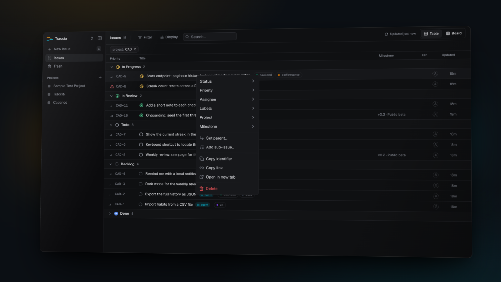
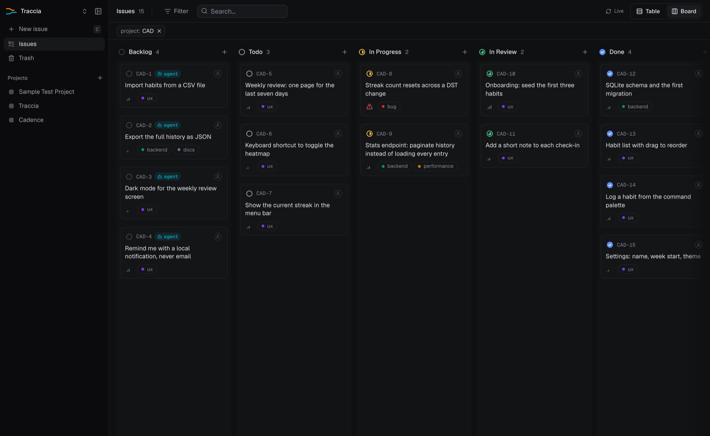

<div align="center">
  
  <h1><samp>Traccia</samp></h1>
  <p><em>You and your agents, on the same page.</em></p>
  
</div>

A minimal, self-hosted issue tracker for one developer and their AI agents. Agents reach it over MCP; you use the dashboard. It runs on a private Tailscale network, and nowhere else.

No accounts, no seats, no sign-up. One SQLite file and one attachments folder, on a box you own.

## Set it up with your agent

Traccia is small enough to install in one sitting, and it is meant to be installed by the agent sitting next to you. Paste the prompt below into Claude Code, Codex or OpenCode. It reads the [self-hosting guide](docs/self-hosting.md) and does the work. You bring a Linux server and a free [Tailscale](https://tailscale.com) account.

```text
You are setting up Traccia, a self-hosted issue tracker, for me.

Read docs/self-hosting.md in https://github.com/matdac12/traccia and follow it end to end. It tells you what to install, how to build and start the containers, how to mint the tokens, and how to publish the app on my tailnet with `tailscale serve`.

Before you touch anything, confirm with me:
- the Linux server you may use (hostname or SSH access, and where you can run commands),
- that I have a Tailscale account and can approve this machine on my tailnet,
- the Tailscale login (an email) to allow into the dashboard.

Then:
1. Install Docker and Tailscale on the server, and bring it onto my tailnet.
2. Clone the repo, build the api and web images, and start the stack.
3. Write /opt/tracker/.env with BASE_URL set to the machine's MagicDNS name, a `you` token, and my Tailscale login.
4. Run the `tailscale serve` mappings, and verify /healthz and the dashboard over the tailnet.
5. Stop and tell me the dashboard URL, the MCP endpoint, and the command to mint an agent token.

Ask before anything destructive. Read hostnames and logins from the machine; never invent them. Keep every secret out of git.
```

## What it is

- Issues with projects, milestones, labels, sub-issues, priorities, estimates and blockers.
- Twenty-one MCP tools, so agents create and update their own work. The list is in [`docs/mcp-tools.md`](docs/mcp-tools.md).
- A dashboard with a table grouped by status, and a Kanban board.
- Attachments, full-text search, and soft delete with restore.
- Two actors only, `you` and `agent`. Every write is attributed.
- One SQLite file plus an attachments folder to back up.

It is deliberately not a team tool, not SaaS, and not a general project manager. The [spec](traccia-spec.md) is the source of truth for what is out of scope.

## Screenshots



The issues table, grouped by status, with inline editing and the row menu.



The same issues as a Kanban board, one column per status.

## Architecture

```
You (browser) ──https://<host>──┐
                                 ├── tailscale serve (443) ── /       ─▶ web  :3000
Agents (MCP)  ──https://<host>──┘                           ── /mcp …  ─▶ api  :8787
                                                                        api ─▶ SQLite + attachments
```

Both containers bind to `127.0.0.1` on your server. `tailscale serve` is the only thing that publishes them, on your tailnet. The api is the only process that touches the database. The dashboard calls the api from server-side code and never exposes its token to the browser.

## Quickstart

Local development needs Node 22 or newer and pnpm 10.

```sh
pnpm install
pnpm check        # lint, typecheck and tests
```

Run the api. `BASE_URL` is required, and `DATA_DIR` defaults to `/data`, so point it somewhere writable:

```sh
export BASE_URL=http://localhost:8787 DATA_DIR=/tmp/traccia-data
mkdir -p "$DATA_DIR"
pnpm --filter api dev
pnpm --filter api traccia token create --name local --actor you
```

Then the dashboard, in another shell:

```sh
export TRACCIA_API_URL=http://localhost:8787 TRACCIA_API_TOKEN=<your token>
pnpm --filter web dev
```

## Self-hosting

The full walkthrough is [`docs/self-hosting.md`](docs/self-hosting.md): a Linux server, Docker and Tailscale. Deploying updates and the build-on-your-Mac flow are in [`deploy/README.md`](deploy/README.md).

## Connect your agents

Create one token per tool and machine, then point the tool at `https://<host>/mcp`. Claude Code, Codex and OpenCode are covered in [`docs/agent-setup.md`](docs/agent-setup.md). Paste [`docs/agent-snippet.md`](docs/agent-snippet.md) into a repo's `AGENTS.md` so its agents follow the tracker's conventions.

## Configuration

One `.env` file in `/opt/tracker` (never committed): the api reads it directly, and the compose file passes the web variables through to the dashboard. The template is [`deploy/.env.example`](deploy/.env.example). The api validates its variables with Zod at startup and exits with a clear message on a bad value; [`apps/api/src/config.ts`](apps/api/src/config.ts) is the only place that reads `process.env`. A test (`apps/api/test/readme.test.ts`) fails if this table misses a variable from `config.ts`.

| Variable | Service | Default | Purpose |
|----------|---------|---------|---------|
| `PORT` | api | `8787` | HTTP port. Fixed to `8787` in the compose file |
| `DATA_DIR` | api | `/data` | SQLite file and attachments. Fixed to `/data` (the data volume, `traccia-data`) in the compose file |
| `BASE_URL` | api | required | Externally visible URL, e.g. `https://<your-tailnet-host>`; used to build attachment links |
| `MAX_ATTACHMENT_BYTES` | api | `10485760` | Per-file cap (10 MiB) |
| `MAX_MCP_UPLOAD_BYTES` | api | `5242880` | Base64 upload cap over MCP (5 MiB) |
| `DEFAULT_ISSUE_KEY` | api | `MAT` | Issue key used when a project is created without one |
| `ALLOW_AGENT_PURGE` | api | `false` | Whether `agent` tokens may purge |
| `RATE_LIMIT_PER_MIN` | api | `120` | Requests per minute, per token |
| `RATE_LIMIT_YOU_PER_MIN` | api | `1200` | Requests per minute, per `you` token (the dashboard fans out several requests per page). Agent tokens keep `RATE_LIMIT_PER_MIN` |
| `LOG_LEVEL` | api | `info` | `fatal`, `error`, `warn`, `info`, `debug`, `trace` or `silent` |
| `TRUST_PROXY` | api | `true` | Read the client IP from `X-Forwarded-For` |
| `SOURCE_URL_EXTRA_PORTS` | api | empty | Comma-separated extra ports MCP `sourceUrl` fetches may use besides 443. Empty means 443 only |
| `PORT` | web | `3000` | Dashboard HTTP port; fixed in the compose file |
| `TRACCIA_API_URL` | web | `http://api:8787` | API address for the dashboard's server-side calls; set by the compose file |
| `TRACCIA_API_TOKEN` | web | empty | Token of a `you` actor, server-side only |
| `DASHBOARD_ALLOWED_LOGINS` | web | empty | Comma-separated Tailscale logins allowed to open the dashboard |

`TRACKER_API_URL` and `TRACKER_API_TOKEN` are the pre-rename names of the two web variables. They are still read when the `TRACCIA_*` name is unset; remove them from the `.env` when convenient. A test (`apps/web/test/env.test.ts`) pins both spellings.

Booleans accept only `true` or `false`. An empty value counts as unset.

## Backups

A daily SQLite snapshot on the server (last 3 kept), a manual pull of the newest snapshot plus attachments to another machine, and a tested restore. See [`docs/backup-restore.md`](docs/backup-restore.md).

## Security

- **Tailnet only.** Nothing listens on a public interface, and Funnel stays off. Bearer tokens decide which actor is calling.
- **Tokens.** One per machine or agent, bound to one actor, stored hashed, shown once, revoked immediately. There is no public token endpoint.
- **Dashboard access** trusts the `Tailscale-User-Login` header that `tailscale serve` adds ([ADR 0008](docs/adr/0008-dashboard-access-identity-header-only.md)). Another process on the server could forge it; revisit if the host ever runs third-party code.
- **Agents cannot purge.** Deletes are soft and restorable ([ADR 0004](docs/adr/0004-soft-delete-batches-restricted-purge.md)).

## Documentation

- [Self-hosting](docs/self-hosting.md)
- [Connect agents](docs/agent-setup.md)
- [MCP tools](docs/mcp-tools.md)
- [Backups and restore](docs/backup-restore.md)
- [Deployment and rollback](deploy/README.md)
- [Spec](traccia-spec.md), [glossary](GLOSSARY.md), [ADR](docs/adr/)

## License

MIT. See [`LICENSE`](LICENSE) and [`THIRD_PARTY_NOTICES.md`](THIRD_PARTY_NOTICES.md).
