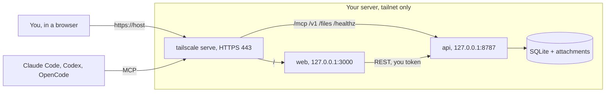

<p align="center">
  <picture>
    <source media="(prefers-color-scheme: dark)" srcset="assets/brand/lockups/traccia-lockup-dark.png">
    
  </picture>
</p>

<p align="center"><strong>You and your agents, on the same page.</strong></p>

<p align="center">
  <a href="LICENSE"></a>
  
  
</p>

Two actors. One trail.

Traccia is a minimal, self-hosted issue tracker for one developer and their AI agents. Agents reach it over MCP. You watch the work land in a dashboard. Everything stays on a private Tailscale network you control.

No accounts. No seats. No sign-up. One SQLite file and one attachments folder, on a box you own.

The spec is [`traccia-spec.md`](traccia-spec.md). The vocabulary is [`GLOSSARY.md`](GLOSSARY.md). The design decisions are in [`docs/adr/`](docs/adr/).

## Set it up with your agent

Traccia is meant to be installed by the agent sitting next to you.

Copy the prompt below into Claude Code, Codex or OpenCode on your machine, and answer its questions. It reads [the self-hosting guide](docs/self-hosting.md) and does the rest. You bring a Linux server and a free [Tailscale](https://tailscale.com) account. That is the whole shopping list.

```text
You are setting up Traccia, a self-hosted issue tracker, for me.

Read docs/self-hosting.md in https://github.com/matdac12/traccia and follow it end to end. It tells you exactly what to install, how to build and start the containers, how to mint the tokens, and how to publish the app on my tailnet with `tailscale serve`.

Before you touch anything, confirm with me:
- the Linux server you may use (hostname or SSH access, and where you can run commands),
- that I have a Tailscale account and can approve this machine on my tailnet,
- the Tailscale login (an email) that should be allowed into the dashboard.

Then:
1. Install Docker and Tailscale on the server, and bring it onto my tailnet.
2. Clone the repo, build the api and web images, and start the stack.
3. Write /opt/tracker/.env with BASE_URL set to the machine's MagicDNS name, a `you` token, and my Tailscale login.
4. Run the `tailscale serve` mappings and verify /healthz and the dashboard over the tailnet.
5. Stop and tell me: the dashboard URL, the MCP endpoint, and the command to mint an agent token. Do not connect my agents for me.

Ask before anything destructive. Read hostnames and logins from the machine; never invent them. Keep every secret out of git.
```

## What you get

- **Issues, done properly.** Projects, milestones, labels, sub-issues, priority, estimates and blockers.
- **Agents that file their own work.** 21 MCP tools, mirroring Linear's names, listed in [`docs/mcp-tools.md`](docs/mcp-tools.md).
- **A calm dashboard.** A table grouped by status, and a Kanban board.
- **Screenshots on issues.** Attachments on an issue or one of its comments.
- **Search that finds it.** Full-text search over titles, descriptions and comments.
- **Delete that forgives.** Delete hides. Restore brings it back. Purge is restricted.
- **Two actors, no more.** `agent` and `you`. Every write is attributed, always.
- **One file to back up.** SQLite plus an attachments folder. Snapshot it and go.

## Not in v1

Teams. Seats. Permissions. Cycles. Documents. Custom statuses or fields. Notifications. Integrations. Time tracking. Roadmaps. Real-time collaboration. A mobile app.

Traccia is for one person, on one tailnet, quietly.

## Architecture



- **api** (`apps/api`): a Hono service. REST (`/v1/*`), MCP (`/mcp`) and attachment downloads (`/files/*`) are thin adapters over one service layer ([ADR 0006](docs/adr/0006-one-service-layer-stateless-mcp-on-hono.md)). It is the only process that touches the database.
- **web** (`apps/web`): the Next.js dashboard. It calls the REST API from server-side code only, with a `you` token held in its environment. The browser never calls the API and never sees the token.
- **State**: one SQLite file plus one attachments folder under `DATA_DIR`, run by a single writer ([ADR 0001](docs/adr/0001-sqlite-single-file-single-writer.md)). Never run two api instances against the same data.
- **Actors**: every token maps to one actor, `agent` (shared by all AI agents) or `you` (the human, including the dashboard's token) ([ADR 0003](docs/adr/0003-two-actors-plain-column.md)).
- **Publishing**: nothing is public. `tailscale serve` is the only publisher, on 443, and Funnel stays off ([ADR 0007](docs/adr/0007-tailnet-only-publishing.md)).
- **`packages/shared`**: shared schemas, types and constants.
- **`assets/brand`**: the mark, the icon ladder and the lockups, with the rules in [`assets/brand/README.md`](assets/brand/README.md).

## Quickstart (local dev)

Node 22 or newer (`nvm use` reads `.nvmrc`) and pnpm 10 (via corepack: `corepack enable`).

```sh
pnpm install
pnpm check       # lint + typecheck + tests (the full gate)
pnpm lint
pnpm typecheck
pnpm test        # api: 30+ test files, runs against temp SQLite files, no services needed
pnpm format      # apply Biome formatting
```

There is no CI. `pnpm install` wires versioned git hooks (`.githooks/`, via `core.hooksPath`): a commit lints the staged files, a push runs `pnpm check`. Bypass with `git commit/push --no-verify`. `pnpm secrets` scans history with gitleaks when it is installed.

Run the api. `BASE_URL` is required, and `DATA_DIR` defaults to `/data`, so point it at a writable folder:

```sh
export BASE_URL=http://localhost:8787 DATA_DIR=/tmp/traccia-data
mkdir -p "$DATA_DIR"
pnpm --filter api dev                   # http://localhost:8787/healthz -> {"ok":true}

# in another shell, with the same BASE_URL and DATA_DIR:
pnpm --filter api traccia token create --name local --actor you
curl -H "Authorization: Bearer <token>" http://localhost:8787/v1/me
```

The CLI (`pnpm --filter api traccia <command>`; in the container it is `node dist/traccia.js`) manages tokens, migrations and snapshots; every command takes `--help`. The database is created and migrated on startup.

The dashboard reads live data, so it needs the api:

```sh
export TRACCIA_API_URL=http://localhost:8787 TRACCIA_API_TOKEN=<your token>
pnpm --filter web dev                   # http://localhost:3000
```

## Run it on your own box

The whole install is a Linux server, Docker, and a Tailscale account. The step-by-step, agent-followable guide is [`docs/self-hosting.md`](docs/self-hosting.md). Deploying updates and the build-on-your-Mac flow are in [`deploy/README.md`](deploy/README.md).

## Connect your agents

Create one token per tool and machine, then point the tool at `https://<host>/mcp`. Claude Code, Codex and OpenCode are covered in [`docs/agent-setup.md`](docs/agent-setup.md). To make an agent follow the tracker's conventions, paste [`docs/agent-snippet.md`](docs/agent-snippet.md) into that repo's `AGENTS.md`.

## Configuration

One `.env` file in `/opt/tracker` (never committed): the api reads it directly, and the compose file passes the web variables through to the dashboard. The template is [`deploy/.env.example`](deploy/.env.example). The api validates its variables with Zod at startup and exits with a clear message on a bad value; [`apps/api/src/config.ts`](apps/api/src/config.ts) is the only place that reads `process.env`. A test (`apps/api/test/readme.test.ts`) fails if this table misses a variable from `config.ts`.

| Variable | Service | Default | Purpose |
|----------|---------|---------|---------|
| `PORT` | api | `8787` | HTTP port. Fixed to `8787` in the compose file |
| `DATA_DIR` | api | `/data` | SQLite file and attachments. Fixed to `/data` (the data volume, `traccia-data`) in the compose file |
| `BASE_URL` | api | required | Externally visible URL, e.g. `https://<your-tailnet-host>`; used to build attachment links |
| `MAX_ATTACHMENT_BYTES` | api | `10485760` | Per-file cap (10 MiB) |
| `MAX_MCP_UPLOAD_BYTES` | api | `5242880` | Base64 upload cap over MCP (5 MiB) |
| `DEFAULT_ISSUE_KEY` | api | `MAT` | Issue key used when a project is created without one |
| `ALLOW_AGENT_PURGE` | api | `false` | Whether `agent` tokens may purge |
| `RATE_LIMIT_PER_MIN` | api | `120` | Requests per minute, per token |
| `RATE_LIMIT_YOU_PER_MIN` | api | `1200` | Requests per minute, per `you` token (the dashboard fans out several requests per page). Agent tokens keep `RATE_LIMIT_PER_MIN` |
| `LOG_LEVEL` | api | `info` | `fatal`, `error`, `warn`, `info`, `debug`, `trace` or `silent` |
| `TRUST_PROXY` | api | `true` | Read the client IP from `X-Forwarded-For` |
| `SOURCE_URL_EXTRA_PORTS` | api | empty | Comma-separated extra ports MCP `sourceUrl` fetches may use besides 443. Empty means 443 only |
| `PORT` | web | `3000` | Dashboard HTTP port; fixed in the compose file |
| `TRACCIA_API_URL` | web | `http://api:8787` | API address for the dashboard's server-side calls; set by the compose file |
| `TRACCIA_API_TOKEN` | web | empty | Token of a `you` actor, server-side only |
| `DASHBOARD_ALLOWED_LOGINS` | web | empty | Comma-separated Tailscale logins allowed to open the dashboard |

`TRACKER_API_URL` and `TRACKER_API_TOKEN` are the pre-rename names of the two web variables. They are still read when the `TRACCIA_*` name is unset; remove them from the `.env` when convenient. A test (`apps/web/test/env.test.ts`) pins both spellings.

Booleans accept only `true` or `false`. An empty value counts as unset.

## Backups

A daily SQLite snapshot on the server (last 3 kept), a manual pull of the newest snapshot plus attachments to another machine, and a step-by-step restore. See [`docs/backup-restore.md`](docs/backup-restore.md) and [ADR 0010](docs/adr/0010-backups-online-snapshot-manual-pull.md). The off-box copy can be stale; that is accepted for v1.

## Security notes

- **Tailnet only.** Nothing listens on a public interface, and Funnel stays off. Tailscale ACLs decide which devices reach the server; bearer tokens decide which actor is calling. Both stay on.
- **Tokens.** Create one per machine or agent. A token is bound to one actor, stored hashed (SHA-256), and shown once at creation. Revocation is immediate. There is no public token endpoint; tokens are managed with the CLI on the server.
- **Dashboard access** compares the `Tailscale-User-Login` header, added by `tailscale serve`, with `DASHBOARD_ALLOWED_LOGINS` ([ADR 0008](docs/adr/0008-dashboard-access-identity-header-only.md)). Accepted risk: another process on the server could forge that header by calling `127.0.0.1:3000` directly. Revisit if the host ever runs third-party code.
- **Agent purge** is off by default (`ALLOW_AGENT_PURGE=false`); deletes by agents are soft and restorable ([ADR 0004](docs/adr/0004-soft-delete-batches-restricted-purge.md)).
- **Attachments** are validated by magic bytes and size, and the MCP `sourceUrl` fetch goes through an SSRF blocklist.

## Known limitations in v1

- Runtimes outside the tailnet cannot reach it (CI, cloud agents, a phone without Tailscale, claude.ai connectors). A later OAuth phase would expose only `/mcp` publicly.
- Full-text search uses Porter stemming, which is English-only; Italian text is matched with accent folding but no stemming.
- No live updates (SSE). The dashboard polls and revalidates on focus.
- The off-box backup can be stale.

## Documentation

| Document | What is in it |
| --- | --- |
| [`docs/self-hosting.md`](docs/self-hosting.md) | Install Traccia on your own server, step by step |
| [`docs/agent-setup.md`](docs/agent-setup.md) | Connect Claude Code, Codex and OpenCode over MCP |
| [`docs/agent-snippet.md`](docs/agent-snippet.md) | The block to paste into another repo's `AGENTS.md` |
| [`docs/mcp-tools.md`](docs/mcp-tools.md) | Every MCP tool and its arguments |
| [`docs/backup-restore.md`](docs/backup-restore.md) | Snapshots, the pull script and the restore procedure |
| [`deploy/README.md`](deploy/README.md) | Deployment, rollback and token management |
| [`traccia-spec.md`](traccia-spec.md) | The source of truth |
| [`GLOSSARY.md`](GLOSSARY.md) | The vocabulary |
| [`docs/adr/`](docs/adr/) | The design decisions |

## License

MIT, see [`LICENSE`](LICENSE). Third-party material (vendored agent skills, shadcn/ui components) keeps its own licence: see [`THIRD_PARTY_NOTICES.md`](THIRD_PARTY_NOTICES.md).

## Layout

- `apps/api`: Hono service (REST, MCP, attachments) and the `traccia` CLI
- `apps/web`: the Next.js dashboard
- `packages/shared`: shared schemas, types, constants
- `deploy/`: compose file, deploy script, backup units, Windows pull script
- `assets/brand`: the mark, icons and lockups
- `docs/`: self-hosting, agent setup, backups, REST notes, ADRs
